# Project Me Finder

####  A Team Week practice in collaboration for Epicodus, 07.06.2020

## By Mariel Hamson, Jason Khan, Sara Kane, Chris Yoon & Brittany Lindgren

## Description

ADD DESCRIPTION

## Setup/Installation Requirements

| Steps | Example |
| -------- | ----- |
| Follow this [link to the project repository](https://github.com/MarielHamson/Project-Me-Finder.git) on GitHub.   |  [Link to the project repository](https://github.com/MarielHamson/Project-Me-Finder.git)  |    
| Click on the "Clone or download" button to copy the project link.   |   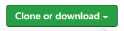   |   
| If you are comfortable with the command line, you can copy the project link and clone it through your command line with the command `git clone` + project link. Otherwise, I recommend choosing "**Download ZIP**".   |   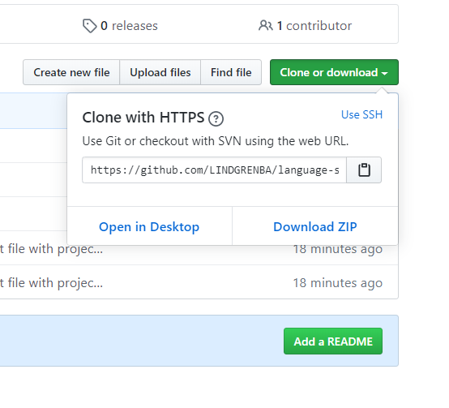  |   
|  Once the ZIP file has finished downloading, you can right click on the file to view the zip folder in your downloads.   |   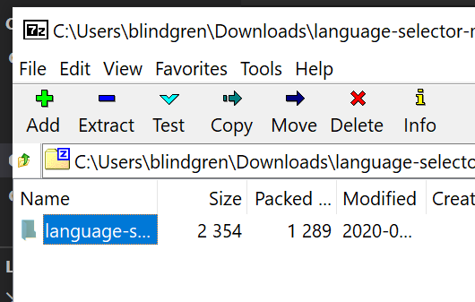  |   
| Right click on the project ZIP folder that you have just downloaded and choose the option "**Copy To...**", then choose the location where you would like to save this folder.    |   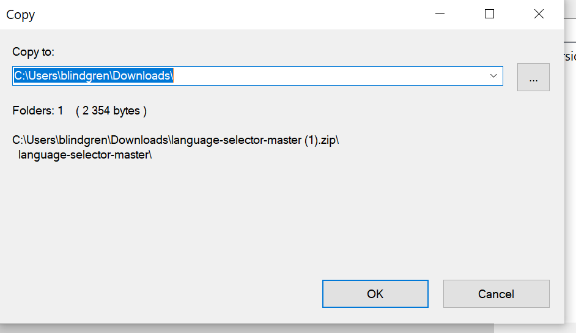  |   
| Navigate to the final location where you have chosen to save the project folder.   |    |   
| To view the code itself, right click, choose "open with..." and open using a text editor such as VS Code or Atom, etc.   |     |
|  Once you have cloned or downloaded the project and opened it in VS Code or another text editor, open a new terminal by navigating to Terminal -> New Terminal. A terminal will open on the page.  | 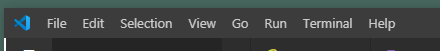  |
| Follow the steps below in the Setup and Installation of Node.js and npm section, then complete the next step in this sequence, running `npm install`  |   ## Setup/Installation of Node.js and npm   |
| In the terminal type the command `npm install` and hit enter to install node modules. You should see a file called node_modules appear and it should be greyed out  |  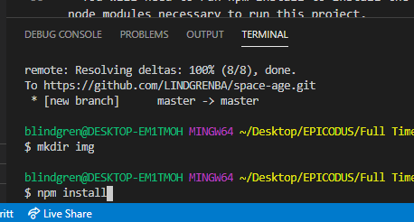  |
| You can now view the project in your browser by typing the command `npm run start` in the terminal  | `npm run start` |   

## Setup/Installation of Node.js and npm

| Steps | Example |
| -------- | ----- |
|    Download Node.js installer from the [Node JS Website](https://nodejs.org/en/download/)    |    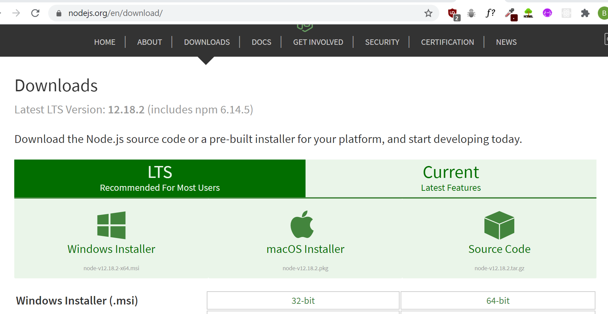   |
|    Once the installer has finished downloaded, click on the 'downloads' link in the browser or navigate to the download on your desktop     |         |
|     Follow the instructions to complete installation of the Node.js software     |         |
|     Verify that you have correctly installed Node.js by opening your command terminal and typing `node -v` |   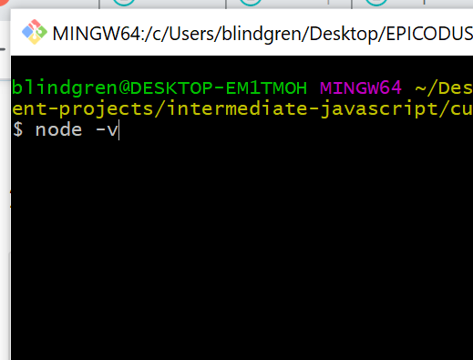    |
|    Verify that you have correctly installed npm by opening your command terminal and typing `npm -v`   |    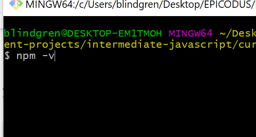     |

#### Get a unique API Key
| Steps | Example |
| -------- | ----- |
| To get an API key for the Project Me Finder website, go to the [Link Text](LINK) website.  |  |
|  Enter your email and click on the 'Get Free Key' button  |    |
|  Enter your information to sign up for a free account  |    |
|  Your API key will be provided to you once you have signed in  |     |
|  Your API key is unique to you. DO NOT SHARE YOUR KEY. Below are the instructions for _`Add .env file`_ which will walk you through setting up a .env file. You will store your key inside of that file to keep it private.  |  see _`Add .env file`_ below  |  
|  After you have added your API key to your .env file _(see instructions below for setting up your .env file)_, type the command `npm run build` into your terminal and hit enter. This will incorporate your unique API into the project  |  |

#### Add .env file to project
| Steps | Example |
| -------- | ----- |
|Create a file named .env in the head (top) directory of the project |     |
| Once you have added the .env file it should be **greyed out**!!! A greyed out file indicates that it is private, will not be available to the public if you push the project to github and will keep any information inside of it **(such as your API key)** private |  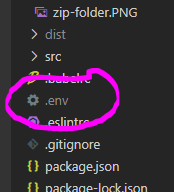  |
|    Inside of your .env file, you can add your API key. See the format in the image to the right.   |   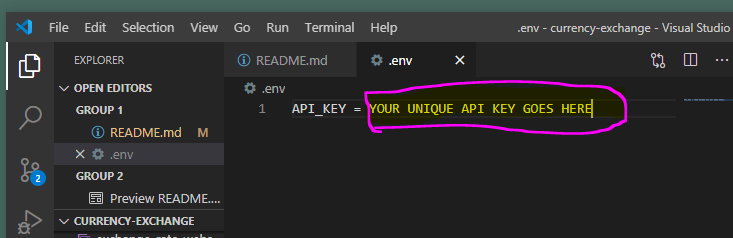    |
| **_IMPORTANT NOTE_**:  Do not delete or change anything in the project's .gitignore file. This file specifies which directories and files are private and should not be shared or shown to others. The .gitignore should look as it does in the example to the right |  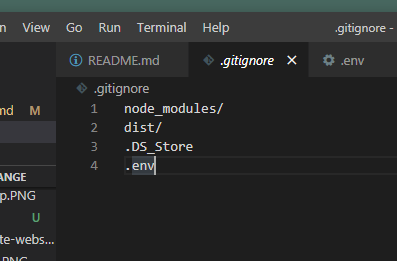  |

#### Additional Setup/Installation Notes:

* You will need to run npm install to install the node modules necessary to run this project. 

* Run a server to view this document using npm start.  

## Specifications MVP

| Behavior | Input | Output |  Completed(Y/N?)  | 
| -------- | ----- | ------ | -------- |
|   Program will search for result based on paramater and return any matching result   |   title   |   specific movie by title   |    N    |
|   Program will accept a variety of parameters and return any matching result    |   actor, director, title, genre    |     specific movies related to parameter selection    |    N   |
| Program will add predefined tags to movies | user selects a predefined tag  | tag added to movie | N |
| Program will create a favorites list that the user can name/title themselves |   User names list `Favorite Directors` |   Charles Burnett  |   N   |
| Program will add a movie to a favorites list | User selects Add `Killer of Sheep` | Favorite Directors {Director: Charles Burnett, Movie Titles: ["Killer of Sheep"]} |   N   |

## Specifications Stretch Goals
| Behavior | Input | Output |  Completed(Y/N?)  | 
| -------- | ----- | ------ | -------- |
| Program will add multiple different favorites lists that user can name/title themselves | new Favorite object, new Favorite object | Favorite Directors, Favorite Genres | N |
| Program will add user rating to movies | User selects 2 stars for Sharknado | Movie object will have rating property | N |

## Known Bugs

| Location (html/css/js & specific location if known) |  Message  | Bug | Resolved (Y/N) |  How was the issue resolved?  |
| ------- | ----- | ------ | ------ | --------- |
|  |  |  |  |  |

## Support and contact details

If you have any questions or comments, please reach out via email at mariel.hamson@gmail.com. 

## Technologies Used

* HTML5
* CSS3
* Bootstrap v-4.5.0
* JavaScript
* jQuery v-3.5.0
* Visual Studio Code 
* Git and Git BASH 
* Node.js
* npm package manager
* Webpack
* API calls
* Asynchronous JavaScript

### License

*This site is licensed under the MIT license.*

Copyright (c) 2020 **_Mariel Hamson, Jason Khan, Sara Kane, Chris Yoon & Brittany Lindgren_**